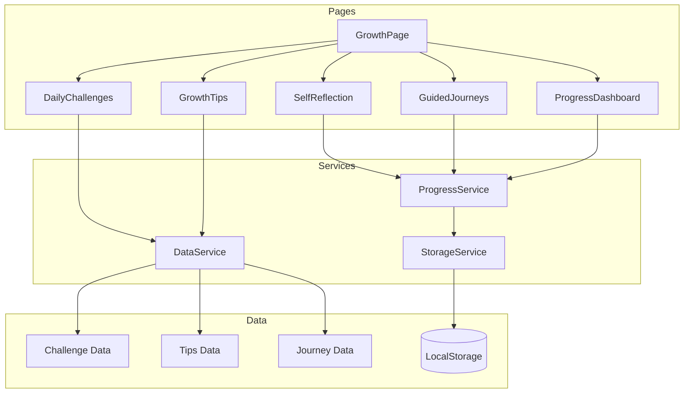

# Design Document: Practical Love Growth

## Overview

The Practical Love Growth feature transforms the website from an informational resource into an actionable platform for personal development. It provides users with daily challenges, growth tips, self-reflection tools, and guided journeys - all focused on helping them practice love in their daily lives.

This feature builds upon the existing `LoveChallengePage` (30-day challenge) and expands it into a comprehensive growth hub with persistent progress tracking via local storage.

## Architecture



### Component Hierarchy

```
GrowthPage (main container)
├── GrowthNavigation (tabs/sections)
├── DailyChallengeSection
│   ├── ChallengeCard
│   ├── ChallengeActions
│   └── ReflectionInput
├── GrowthTipsSection
│   ├── CategoryFilter
│   ├── TipCard
│   └── ExerciseSteps
├── SelfReflectionSection
│   ├── ReflectionPrompt
│   ├── ResponseInput
│   └── ReflectionHistory
├── GuidedJourneysSection
│   ├── JourneyCard
│   ├── JourneyProgress
│   └── JourneyStep
└── ProgressDashboard
    ├── ProgressStats
    ├── CompletionHistory
    └── Milestones
```

## Components and Interfaces

### Data Types

```typescript
// Challenge Types
interface Challenge {
  id: string;
  title: string;
  description: string;
  actionStep: string;
  category: LoveCategory;
  timeframe: 'daily' | 'weekly';
  scriptureReference?: string;
}

interface ChallengeCompletion {
  challengeId: string;
  completedAt: string; // ISO date
  reflection?: string;
}

// Growth Tip Types
type LoveCategory = 'patience' | 'kindness' | 'forgiveness' | 'empathy' | 'humility' | 'trust' | 'perseverance';

interface GrowthTip {
  id: string;
  title: string;
  category: LoveCategory;
  summary: string;
  content: string;
  exercises: Exercise[];
}

interface Exercise {
  id: string;
  title: string;
  steps: string[];
  duration: string;
}

// Self-Reflection Types
interface ReflectionPrompt {
  id: string;
  question: string;
  category: LoveCategory;
  followUp?: string;
}

interface ReflectionEntry {
  id: string;
  promptId: string;
  response: string;
  createdAt: string; // ISO date
}

interface ReflectionSession {
  id: string;
  entries: ReflectionEntry[];
  completedAt: string;
}

// Journey Types
interface Journey {
  id: string;
  title: string;
  description: string;
  durationDays: number;
  steps: JourneyStep[];
  category: LoveCategory;
}

interface JourneyStep {
  id: string;
  dayNumber: number;
  title: string;
  content: string;
  scriptureReference?: string;
  actionItem: string;
}

interface JourneyProgress {
  journeyId: string;
  currentStepIndex: number;
  startedAt: string;
  completedSteps: number[];
  completedAt?: string;
}

// Progress Types
interface UserProgress {
  completedChallenges: ChallengeCompletion[];
  reflectionSessions: ReflectionSession[];
  journeyProgress: JourneyProgress[];
  lastVisit: string;
}
```

### Service Interfaces

```typescript
// Storage Service - handles local storage operations
interface StorageService {
  save<T>(key: string, data: T): void;
  load<T>(key: string): T | null;
  remove(key: string): void;
  clear(): void;
}

// Progress Service - manages user progress
interface ProgressService {
  getProgress(): UserProgress;
  saveProgress(progress: UserProgress): void;
  completeChallenge(challengeId: string, reflection?: string): void;
  saveReflectionSession(session: ReflectionSession): void;
  startJourney(journeyId: string): void;
  completeJourneyStep(journeyId: string, stepIndex: number): void;
  getJourneyProgress(journeyId: string): JourneyProgress | null;
}

// Data Service - provides content data
interface DataService {
  getDailyChallenge(date: Date): Challenge;
  getChallenges(): Challenge[];
  getTips(): GrowthTip[];
  getTipsByCategory(category: LoveCategory): GrowthTip[];
  getJourneys(): Journey[];
  getJourney(id: string): Journey | null;
  getReflectionPrompts(): ReflectionPrompt[];
  searchContent(query: string): SearchResult[];
}
```

## Data Models

### Local Storage Schema

```typescript
// Key: 'practical-love-progress'
interface StoredProgress {
  version: number; // For future migrations
  data: UserProgress;
  updatedAt: string;
}

// Key: 'practical-love-reflections'
interface StoredReflections {
  sessions: ReflectionSession[];
}
```

### Static Content Data

Content will be stored as TypeScript constants for simplicity:

- `challenges.ts` - Array of Challenge objects
- `tips.ts` - Array of GrowthTip objects  
- `journeys.ts` - Array of Journey objects
- `reflectionPrompts.ts` - Array of ReflectionPrompt objects

## Correctness Properties

*A property is a characteristic or behavior that should hold true across all valid executions of a system-essentially, a formal statement about what the system should do. Properties serve as the bridge between human-readable specifications and machine-verifiable correctness guarantees.*

### Property 1: Challenge data completeness
*For any* Challenge object, it SHALL contain a non-empty title, description, actionStep, and valid category.
**Validates: Requirements 1.2**

### Property 2: Daily challenge determinism
*For any* given date, the getDailyChallenge function SHALL return the same challenge when called multiple times with that date.
**Validates: Requirements 1.3**

### Property 3: Challenge completion persistence round-trip
*For any* challenge completion saved via completeChallenge, retrieving progress via getProgress SHALL include that completion with matching challengeId and reflection.
**Validates: Requirements 1.4, 3.2, 5.3**

### Property 4: Growth tips category validity
*For any* GrowthTip object, its category SHALL be one of the valid LoveCategory values, and getTipsByCategory SHALL return only tips matching the requested category.
**Validates: Requirements 2.3**

### Property 5: Exercise steps completeness
*For any* Exercise object, it SHALL contain a non-empty title and a steps array with at least one step.
**Validates: Requirements 2.4**

### Property 6: Reflection session round-trip
*For any* ReflectionSession saved via saveReflectionSession, retrieving progress SHALL include that session with all original entries preserved.
**Validates: Requirements 3.2, 3.4**

### Property 7: Journey data completeness
*For any* Journey object, it SHALL contain a non-empty title, description, positive durationDays, and at least one step.
**Validates: Requirements 4.1**

### Property 8: Journey step progression
*For any* journey, completing step N via completeJourneyStep SHALL update currentStepIndex to N+1 (if not final step) and add N to completedSteps.
**Validates: Requirements 4.3, 4.4**

### Property 9: Journey progress persistence
*For any* journey started via startJourney, getJourneyProgress SHALL return progress with currentStepIndex of 0 and the correct journeyId.
**Validates: Requirements 4.2, 4.5**

### Property 10: Search results relevance
*For any* search query, all returned results SHALL contain the query string (case-insensitive) in their title, description, or content.
**Validates: Requirements 6.3**

## Error Handling

| Scenario | Handling |
|----------|----------|
| Local storage unavailable | Fall back to in-memory storage with warning toast |
| Local storage quota exceeded | Show error toast, suggest clearing old data |
| Invalid data in storage | Reset to defaults, log error |
| Missing content data | Show placeholder with "Content coming soon" |
| Journey step out of bounds | Clamp to valid range |

## Testing Strategy

### Unit Testing
- Use Vitest as the test runner (already compatible with Vite setup)
- Test individual service functions
- Test data validation functions
- Test date-based challenge selection logic

### Property-Based Testing
- Use fast-check library for property-based testing
- Configure minimum 100 iterations per property test
- Each property test tagged with format: `**Feature: practical-love-growth, Property {number}: {property_text}**`

### Test Coverage Focus
1. Storage service round-trip operations
2. Progress service state management
3. Data service query functions
4. Challenge rotation logic
5. Journey progression logic
